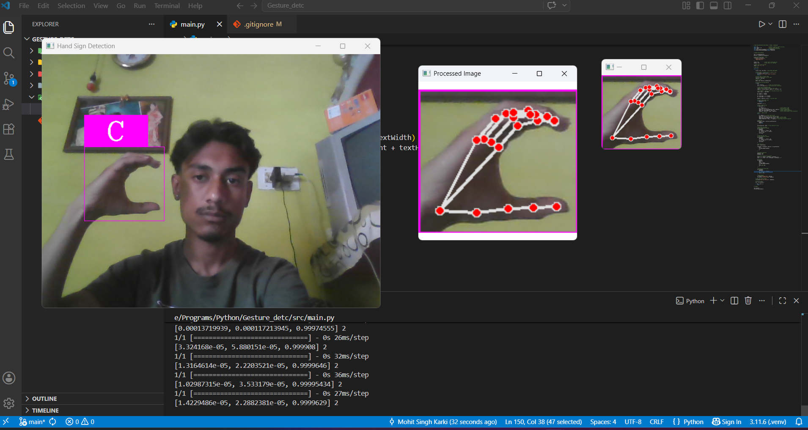
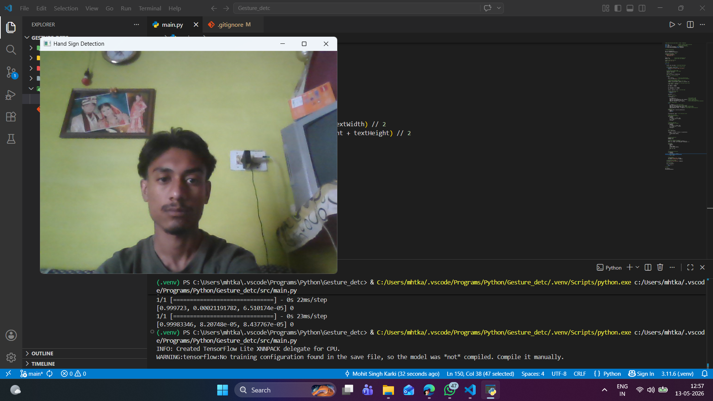

# Hand Sign Detection

Real-time hand sign detection system using OpenCV, CVZone, and TensorFlow.

---

## Features

- Real-time webcam hand sign detection
- TensorFlow deep learning model integration
- Hand tracking using CVZone
- OpenCV image processing
- Live prediction display
- Bounding box visualization
- Real-time gesture recognition

---

## Tech Stack

- Python
- OpenCV
- TensorFlow
- CVZone
- NumPy

---

## Screenshots

### Real-Time Detection

### Processed Image

